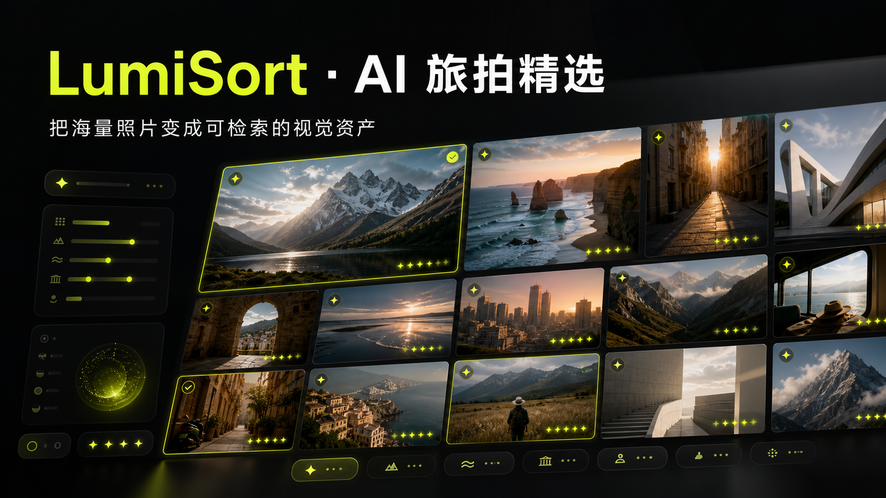

# LumiSort · 旅光

An interactive AI photo-culling demo for portraits and landscapes, with a configurable multi-dimensional quality model.

> 自动识别人像与风景照片中的虚焦、运动拖影、相机抖动、过曝与欠曝，再将达标照片转化为可检索的视觉资产。

[Live Demo](https://lumisort-vincent-photo-ai.haoy6092.chatgpt.site)



## Product highlights

- Drag-and-drop or select local photos for a complete import flow.
- Choose from 15 quality dimensions or switch between fast, portrait and landscape presets.
- Recalculate the delivery-quality score from the selected dimensions and automatically isolate photos below the 7.5 threshold.
- Surface specific reject reasons such as face blur, motion blur and highlight clipping for manual review.
- Extract Chinese semantic tags, visible entities and visual mood.
- Search with natural-language descriptions and combine them with score filters.
- Review photo details, favorites, EXIF-style metadata and dominant colors.
- Remove unwanted photos from the library with a six-second undo action.
- Switch between guest and demo-account states from the profile panel.
- Persist device-local language and global font-size preferences.
- Export the structured photo-asset library as JSON.
- Run immediately in portfolio demo mode, without an API key.
- Switch to any OpenAI-compatible vision endpoint through server-side environment variables.

## How it works

```text
Local photos
    ↓
Portrait + landscape quality analysis
    ↓
15 optional dimensions across sharpness / light / portrait / scene structure
    ↓
Reject reasons + EXIF-style metadata fusion
    ↓
Qualified portraits / reject review / semantic search
    ↓
Structured JSON asset export
```

## Tech stack

- React 19 + TypeScript
- Vinext + Vite
- Tailwind CSS + shadcn primitives
- Lucide icons
- Cloudflare Workers-compatible server route
- OpenAI-compatible multimodal API contract

## Run locally

Requirements: Node.js 22.13+ and pnpm.

```bash
pnpm install
pnpm dev
```

Open `http://localhost:3000`.

## Connect a vision model

The repository ships with a safe demo fallback. To use a real model, copy the example environment file and provide a compatible endpoint:

```bash
cp .env.example .env.local
```

```env
DEEPSEEK_API_KEY=your_server_side_key
DEEPSEEK_VISION_BASE_URL=https://api.deepseek.com/chat/completions
DEEPSEEK_VISION_MODEL=deepseek-v4-flash-vision-exp
```

The API key is read only by the server route and is never included in browser code. Because provider model names and multimodal support can change, use the vision-capable model identifier offered by your provider.

## API response shape

```json
{
  "score": 8.9,
  "composition": 8.5,
  "color": 8.8,
  "clarity": 9.2,
  "exposure": 8.8,
  "faceQuality": 9.1,
  "issues": [],
  "tags": ["旅拍人像", "自然光", "清晰"],
  "entities": ["人脸", "人物", "街景"],
  "mood": "松弛",
  "summary": "人脸对焦准确、曝光正常，达到旅拍交付标准。"
}
```

The server evaluates only the dimensions chosen by the user and calculates their equal-weight average, so a portrait delivery workflow and a landscape workflow can use different quality models.

## Privacy

- Imported images remain in memory in the current browser session in demo mode and disappear after refresh.
- The current demo does not have user accounts, D1 metadata persistence or R2 image storage.
- The profile panel intentionally simulates account creation and sign-in; it never stores submitted demo credentials on a server.
- No API key is committed to the repository.
- Configure production secrets through the hosting platform rather than source files.

## License

[MIT](./LICENSE)
